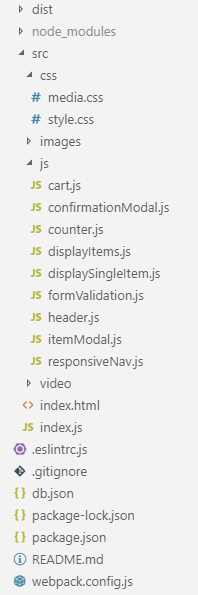
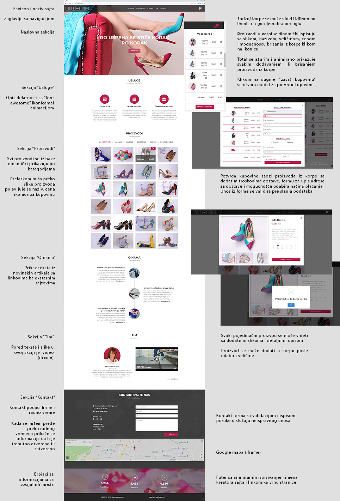

## O projektu Mosaic - shoes
Sajt sa internet prodavnicom gde se korisnik može informisati o domaćem brendu MOSAIC shoes,
kupiti proizvode ili poslati poruku preko kontakt forme. Sadršaj je responzivan. Namenjeno ženskoj populaciji.

## Tehnologije korišćene pri razvoju
Za strukturu i izgled sajta korišćeni su <b>Html</b> i <b>Css</b>, a za dinamičnost i interakciju sa korisnikom <b>JavaScript/EcmaScript</b>.
Za lakšu manipulaciju korišćen je <b>Jquery</b>, a za animiranje sadržaja korišćene su biblioteke <b>Scroll Magic</b>, <b>AOS</b>, <b>Count Up</b> i <b>Sweet Alert</b>.

Javascript kod je organizovan po modulima i korišćen je <b>Node Package Manager (npm)</b> i <b>Webpack</b> kao "module bundler" uz dodatne funkcionalnosti <b>webpack loader-a</b> i <b>webpack plugin-a</b>.
U projekat je implementiran <b>Bubel</b> transpajler, a da bi kod bio standardizovanog izgleda implementiran je <b>Eslint</b>.

<b>JSON server</b> je korišćen kao "mock server" sa bazom podataka.

## Struktura projekta

## Pokretanje projekta
npm i

npm run start

npm run server

Otvoriti http://localhost:8080/ za prikaz u pretraživaču.

## Detalji o projektu

